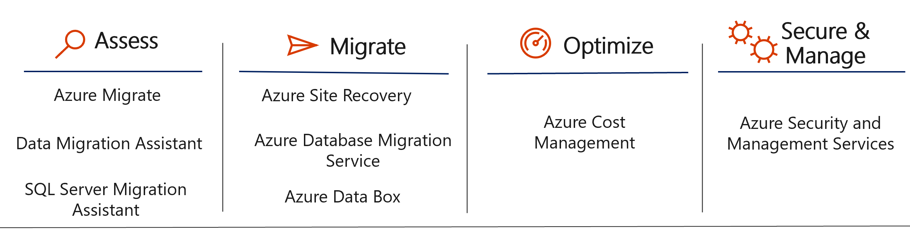

# Migration
Migration Task - Example on how to migrate your Windows Server 2008 R2 and Microsoft SQL Server 2008 R2 to Microsoft Azure;

# Team
Hugo / Paul / Sergio / Ed / Nathan
## Step 1: Planning
* 1.1 - Let's start the session planning the for the migration.
Please find below the Migration in few steps:

  

